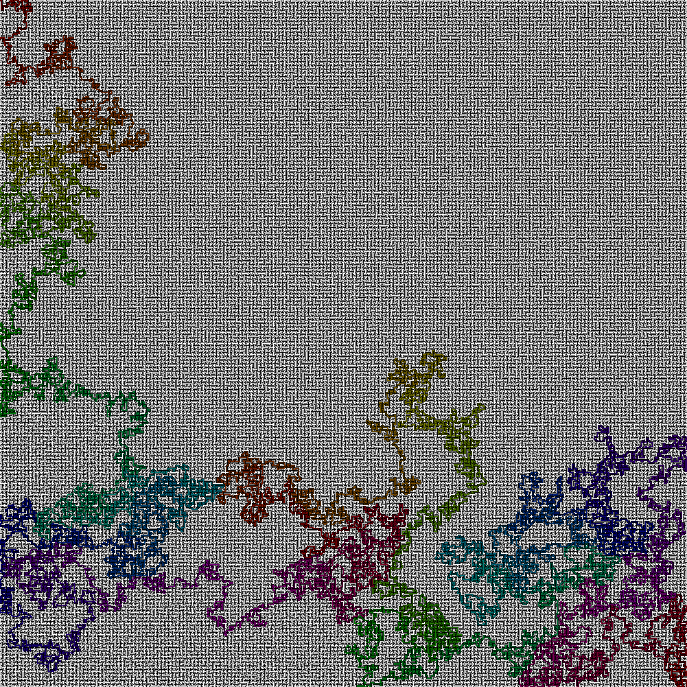

## 'The Hardest Maze' Solver

In a [since deleted Reddit Post](https://www.reddit.com/r/Python/comments/vy8xed/hardest_maze_on_earth/), user **u/Rabby_FN_yt1** asked about solving the 'Hardest Maze' using Python. I got a little [nerd sniped](https://xkcd.com/356/) by this question, and whipped up a little maze solver.
### Solution

<figure>
<a href="worstmaze.jpg"></a>
<figcaption>Click to see solution(1000x1000</figcaption>
</figure>

### Using The Solver

The solver can be adapted to any maze image with single-pixel-wide paths, where the walls are black (or dark) and the path is white (or lightly colored). The original image was given as a JPEG with some artificating, so a certain amount of leeway is given when parsing the image. Spaces outside the borders of the image are treated as walls.

To use the solver on your own image, follow the steps below (as in `main.py`):

```python3
my_maze = load_maze(f'maze.jpg')
result, path = solve_maze(my_maze, start, end)
```

To have Pillow display the solution in your default image viewer, use:

```
display_solved_maze(result, path, hue_speed = 2)
```

Or, to save the solved maze to a file, use:
```
export_solved_maze_image("solved_maze.png", result, path, hue_speed = 2):
```

The `hue_speed` paramater affects how quickly the solution path cycles through a rainbow of colors. Try adjusting this parameter to make your path clearer to follow.