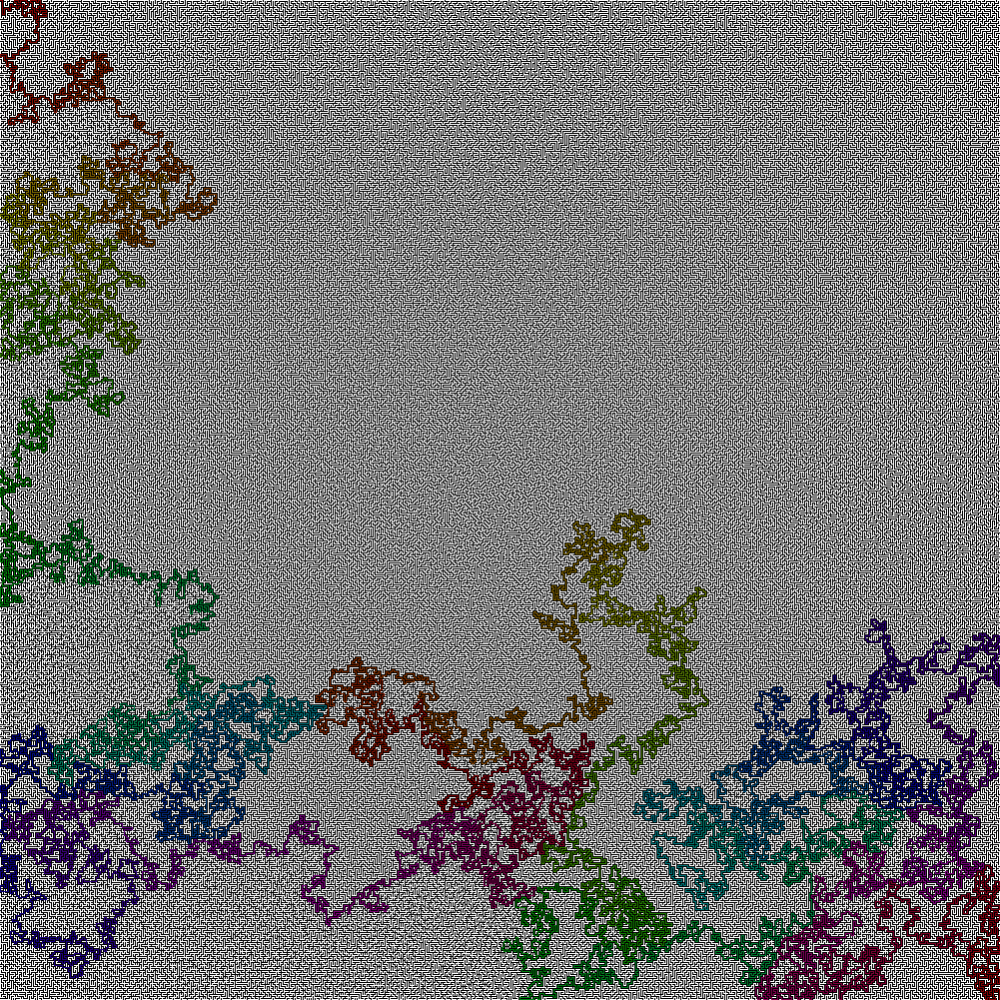

## 'The Hardest Maze' Solver

In a [since deleted Reddit Post](https://www.reddit.com/r/Python/comments/vy8xed/hardest_maze_on_earth/), user **u/Rabby_FN_yt1** asked about solving the 'Hardest Maze' using Python. I got a little [nerd sniped](https://xkcd.com/356/) by this question, and whipped up a little maze solver.
### Solution

<a href="hardestmaze_solved.jpg">
<figure>

<br><figcaption>Click to view the full maze with solution (1000x1000)</figcaption>
</figure>
</a>

### Using The Solver

The solver can be adapted to any maze image with single-pixel-wide paths, where the walls are black (or dark) and the path is white (or lightly colored). The original image was given as a JPEG with some artificating, so a certain amount of leeway is given when parsing the image. Spaces outside the borders of the image are treated as walls.

To use the solver on your own image, download or clone this repository, and install the requirements using `pip` or `pipenv`:

```PowerShell
pipenv install
pipenv shell 
```

Then follow the steps below (as in `main.py`):

```python
my_maze = load_maze(f'maze.jpg')
result, path = solve_maze(my_maze, start, end)
```

To have Pillow display the solution in your default image viewer, use:

```python
display_solved_maze(result, path, hue_speed = 2)
```

Or, to save the solved maze to a file, use:
```python
export_solved_maze_image("solved_maze.png", result, path, hue_speed = 2):
```

The `hue_speed` paramater affects how quickly the solution path cycles through a rainbow of colors. Try adjusting this parameter to make your path clearer to follow.

### How the Solver Works

#### Loading the Maze

First, [load_maze()](https://github.com/JeffersGlass/maze-solver/blob/main/mazeio.py#L8-L23) uses [Pillow](https://pillow.readthedocs.io/en/stable/) to load an image file, and parse whether each pixel is a WALL or EMPTY based on its color (white = empty, black = wall). To gracefully handle JPEG images, any pixel with value (lightness) greater than 90% is considered empty.

#### Solving the Maze

[solve_maze()](https://github.com/JeffersGlass/maze-solver/blob/main/solvemaze.py#L10-L51) takes the loaded maze and two (x,y) tuples representing coordinates of the start and end points. Note that most image-manipulation programs use 1-based indexing, while Python (and this code) use 0-based indexing, so use caution if you're using, say, MS paint to identify the coordinates of your start/end ponits.

_solve_maze()_ uses a [deque](https://docs.python.org/3/library/collections.html#collections.deque) as stack to hold the positions to be checked next. Deque was selected for its O(1) efficiency for pop() and append() operations, but there may be a better data structure out there.

We add the starting position to the stack, and, until we find the end of the maze:

  1. Pop a position off the end of the stack
  2. If the position is the END, return and celebrate!
  3. If the position has already been visited, discard this position and continue with the next one
  4. Otherwise, mark this position as already having been visited, and
  5. Add any/all of the 4 neighbors of this cell to the stack, if they're EMPTY or the END cell.

#### Backtracking the Path

Each position that we store on the solve stack is actually a [PositionAndPath](https://github.com/JeffersGlass/maze-solver/blob/main/positionAndPath.py#L4-L16) object, a simple dataclass that tracks both a single coordinate position and the position that immediately lead to it as we traversed the maze. This creates a linked-list for our path, from the end cell to the beginning.

Once the solution is found, we follow references from the end cell backward, flattening the list for later use.

#### Displaying the Solution

Once we have the solution path for the maze, we use Pillow to display it for the user. We create a new Pillow image the same size as the original maze, and iterate over the full image to draw the empty spaces and walls. Then we iterate over the solution path spaces and color them in, making use of [colorsys.hsv_to_rgb()](https://docs.python.org/3/library/colorsys.html) to translate our index along the path into a varying hue.
